# BharatBid

**Procurement Intelligence & Evidence-Based Bid Evaluation**

[](docs/BHARATBID_ARCHITECTURE.md)
[](PROBLEM_STATEMENT.md)
[](#architecture)
[](#honesty-bar)

BharatBid is a **decision-support workspace** for government procurement officers. It puts tenders, bidder evidence, labeled source checks, cross-checks, officer review, explainable attention, comparative evaluation, and PDF reports in one place.

It does **not** award, reject, rank, or disqualify a bidder. Officers remain the decision-makers.

```
┌──────────────────────────────────────────────────────────────────────────┐
│  BharatBid                                          DEMO / SYNTHETIC    │
│  Procurement Intelligence Command Center                                │
├────────────┬─────────────────────────────────────────────────────────────┤
│ Command    │  Active tenders · Submitted bids · Open reviews                │
│ Center     │  Evidence gaps · Verification issues · Evaluations             │
│ Tenders    │                                                             │
│ Bidders    │  Bid intelligence · Officer advisory                          │
│ Bids       │  Officer Review Priority queue                                 │
│ Review     │  Evidence health · Verification health · Activity            │
│ Attention  │                                                             │
│ Evaluation │                                                             │
│ Activity   │                                                             │
└────────────┴─────────────────────────────────────────────────────────────┘
```

> **Honesty bar.** Adapters in this repository are **DEMO / SYNTHETIC / MOCK / SIMULATED**. They are not live GSTN, MCA21, Udyam, GeM, PAN, Income Tax, EPFO, ESIC, NSIC, DPIIT, BIS, or DigiLocker APIs. BharatBid is **not** an official Government of India product.

---

## The problem this product is for

CPSE procurement (GeM / CPCL-style) is document-heavy. Officers must inspect GST, PAN, MSME, OEM letters, Make in India declarations, and other evidence while also noticing mismatches across sources. That work is usually spread across folders, portals, and email.

**BharatBid’s job** is to make that inspection **traceable**:

1. What evidence was submitted?
2. What did a labeled DEMO source return?
3. Where do sources disagree?
4. What still needs a human?
5. What did the officer finally record?

Smart India Hackathon — Problem Statement **26100** (Ministry of Petroleum & Natural Gas / CPCL context). Product statement: [PROBLEM_STATEMENT.md](PROBLEM_STATEMENT.md).

---

## What you actually see in the UI

The app is a **sidebar + workspace**. `/` redirects to Command Center after sign-in. The sidebar footer always shows **DEMO / SYNTHETIC**.

### Sidebar (every authenticated screen)

| Nav item | Route | What the officer is looking at |
| --- | --- | --- |
| Command Center | `/bharatbid` | Operational dashboard for the whole file |
| Tenders | `/bharatbid/tenders` | Tender list, create, open a file |
| Bidders | `/bharatbid/bidders` | Bidder profiles (PAN/GSTIN shown as provided / not provided) |
| Bids | `/bharatbid/bids` | Submissions against tenders |
| Review | `/bharatbid/review` | Officer review queue |
| Attention | `/bharatbid/intelligence` | Officer Review Priority list |
| Evaluation | `/bharatbid/evaluation` | Comparative evaluation workspaces |
| Activity | `/bharatbid/activity` | Officer vs system timeline |
| Notifications | `/bharatbid/notifications` | In-app inbox |

### 1. Sign in — `/login`

Product identity card: BharatBid, SIH 26100, DEMO / SYNTHETIC. Session uses JWT. Role is shown in the shell after login.

| Role | Account | Password | In the UI |
| --- | --- | --- | --- |
| Procurement officer | `demo.officer@example.com` | `demo-password` | Create tenders, run DEMO checks, generate reports |
| Reviewer | `demo.reviewer@example.com` | `demo-password` | Read the same files; write actions hidden / 403 |
| Admin | `demo.admin@example.com` | `demo-password` | Platform administration |

### 2. Command Center — `/bharatbid`

This is the home screen. It **aggregates** existing records. It does not invent a second ranking engine.

**KPI row (each card opens a workspace)**

| Tile | Meaning |
| --- | --- |
| Active tenders | Open and under evaluation |
| Submitted bids | Submitted / under review / finalized |
| Open reviews | Open + in review |
| Pending clarifications | In-app clarification still waiting |
| Evidence gaps | Mandatory requirements without mapped evidence |
| Verification issues | Mismatched, not found, or adapter error |
| Evaluations in progress | Evaluation started or ready for decision |

**Health panels on the same page**

- **Officer Review Priority** — highest-attention bids first; click a row to open that bid’s Intelligence tab
- **Evidence health** — available / missing / processing / conflicts
- **Bid intelligence** — compliance coverage average, high review-risk count, pending requirements, officer advisory
- **Verification health** — matched / mismatched / not found / error, by DEMO source
- **Review and evaluation workload**
- **Recent activity** — officer actions vs system events

### 3. Tender file — `/bharatbid/tenders/:id`

Reference, organisation, category, status, schedule, ordered requirements, and participating bids. Seed showcase tender: **`GEM/2026/B/CPCL/001`** (industrial valves).

### 4. Bid workspace — `/bharatbid/bids/:id`

This is the core product UI. Tabs change the URL. Counts in the tab labels come from the bid file.

```
Overview | Documents | Verification | Cross-Checks | Requirements | Review | Intelligence | Evaluation | Activity
```

| Tab | Route suffix | What it explains |
| --- | --- | --- |
| **Overview** | `/bids/:id` | Submission status, Officer Review Priority meter, **compliance coverage**, **review risk**, officer advisory, evidence and verification summaries |
| **Documents** | `/documents` | Upload, type, version, requirement mapping, extraction, preview/download (authenticated) |
| **Verification** | `/verification` | DEMO source list, run a check, field comparison, GST Return Filing attribute, source snapshot |
| **Cross-Checks** | `/cross-checks` | GST ↔ MCA, GST ↔ Udyam, MCA ↔ Udyam. Consistent / difference / insufficient evidence |
| **Requirements** | `/requirements` | Evidence Coverage matrix — missing evidence is not an automatic fail |
| **Review** | `/review` | Machine finding vs officer assessment vs clarification. Machine finding is not a government result |
| **Intelligence** | `/intelligence` | Attention factors, coverage factors, Make in India class, OEM comparison, DigiLocker DEMO marker, information gaps |
| **Evaluation** | `/evaluation` | Jump into the tender comparison for this bid |
| **Activity** | `/activity` | Audit trail for this bid |

**Seed story to show judges**

| Bid | Story |
| --- | --- |
| **Bayfront** `BID-GEM2026BCPCL001-0001` | Stronger evidence, DEMO matches, debarment not found |
| **Delta** `BID-GEM2026BCPCL001-0002` | Attention-heavy: mismatches, GeM inactive, DEMO debarment record found (officer must review — not auto-reject) |

### 5. Officer Review Priority — `/bharatbid/intelligence`

A **0–100 review-priority indicator** with band, factor breakdown, and links back to evidence. It is **not** a winner score, fraud score, or award.

**Procurement Review Risk** (LOW / MODERATE / HIGH / CRITICAL) is derived from those bands. A DEMO debarment `RECORD_FOUND` raises LOW/MODERATE to HIGH. Still not a fraud model.

### 6. Comparative evaluation — `/bharatbid/evaluation/:tenderId`

Side-by-side bids, requirement cells that open supporting evidence, officer notes, decision-support states. No “winner” column. **Generate report** downloads a PDF that repeats the decision-support disclaimer and **DEMO / SYNTHETIC DATA**.

---

## How a bid is inspected (end to end)

```mermaid
flowchart LR
  A[Login] --> B[Command Center]
  B --> C[Tender]
  C --> D[Bid]
  D --> E[Documents]
  E --> F[DEMO verification]
  F --> G[Cross-checks]
  G --> H[Requirements]
  H --> I[Coverage / risk / advisory]
  I --> J[Officer review]
  J --> K[Officer Review Priority]
  K --> L[Compare bids]
  L --> M[Officer decision]
  M --> N[PDF report]
```



Walkthrough with timing: [docs/BHARATBID_DEMO_GUIDE.md](docs/BHARATBID_DEMO_GUIDE.md).

---

## What the product does (and what the labels mean)

| Capability | In the product | What it is **not** |
| --- | --- | --- |
| DEMO adapters: GST, MCA, Udyam, GeM, PAN, Income Tax, EPFO, ESIC, DPIIT, NSIC, BIS, debarment | Verification tab, labeled **DEMO SOURCE** | Live government APIs |
| GST return filing | Attribute on the DEMO GST snapshot (`FILED` / `NOT_FILED` / `DELAYED` / `NOT_AVAILABLE`) | GSTN filing download |
| Make in India | `CLASS_I` / `CLASS_II` / `NOT_DECLARED` from the declaration | Automatic eligibility |
| OEM authorization | Structured match vs bid claim | Brand-portal authenticity |
| DigiLocker-style marker | Text marker `ISSUED` / not issued | Real DigiLocker |
| Evidence & Compliance Coverage | Explainable 0–100 decision-support score | Official government compliance |
| Officer advisory | Deterministic bullets from gaps and DEMO results | Approve / reject / winner text |
| Officer Review Priority | Explainable attention | Ranking of bidders |
| PDF reports | Decision-support record | Award letter |

PAN is masked in verification lists (`ABCDE****F`). Search, audit metadata, and report tables omit PAN / GSTIN / CIN / Udyam.

---

## Architecture

```text
React / Vite  →  Express /api/v1  →  BharatBid services (backend/src/problem/)
                                          ↓
                                    Prisma → PostgreSQL
                                          ↓
                    Storage · extraction · notifications · PDF · audit · jobs
```

| Layer | Where | Responsibility |
| --- | --- | --- |
| UI | `frontend/src/pages/bharatbid/` | Workspaces above |
| API | `backend/src/routes/bharatbid.routes.ts` | Auth + RBAC envelopes |
| Domain | `backend/src/problem/` | Tenders, evidence, verification, intelligence, review, evaluation |
| Adapters | `backend/src/problem/verification/` | DEMO registries only |
| Coverage | `backend/src/problem/coverage/` | Coverage, review risk, advisory, MII, OEM, gaps — compute-on-read |

Shared infrastructure BharatBid uses: authentication, RBAC, audit, storage, document extraction, PDF/reports, notifications, optional Redis/BullMQ.

Full write-up: [docs/BHARATBID_ARCHITECTURE.md](docs/BHARATBID_ARCHITECTURE.md).

---

## Run it locally

**Needs:** Node.js 20+ and Docker Desktop (PostgreSQL + Redis).

On Windows, keep `127.0.0.1` in `DATABASE_URL` (see `.env.example`). `localhost` can resolve to IPv6 and Prisma fails with P1001.

```bash
npm install
cp .env.example .env
npm run deps:up
npm run db:migrate
npm run db:seed
npm run dev
```

| Surface | URL |
| --- | --- |
| Command Center | http://127.0.0.1:5173/ |
| Sign in | http://127.0.0.1:5173/login |
| API | http://127.0.0.1:5000 |
| Health | http://127.0.0.1:5000/health |

Full-stack Docker: `docker compose up --build`. See [docs/getting-started.md](docs/getting-started.md).

Demo database name is `hackathon` on host port **5433**. Do not run `npm run db:reset` against a working demo. The Compose project name remains `hackathon-starter-kit` so existing Docker volumes stay attached. Runtime identity is `APP_NAME=BharatBid`.

```bash
npm run lint
npm run typecheck
npm test
npm run build
```

HTTP tests (separate `hackathon_test` database):

```bash
cp .env.test.example .env.test
npm run db:test:prepare
npm run test:integration -w backend
```

---

## DEMO / MOCK / SYNTHETIC — do not claim these in a demo

* Live GSTN / MCA21 / Udyam / GeM / PAN / IT / EPFO / ESIC / NSIC / DPIIT / BIS / DigiLocker
* Automatic award, rejection, or bidder ranking
* Fraud detection or a government “trust score”
* Government certification of this software
* Demo passwords outside local SIH use

Do **not** say on stage: winner, best bidder, automatically approved, government verified, live GST integration, fraud detected.

---

## Documentation

| Document | Purpose |
| --- | --- |
| [docs/BHARATBID_ARCHITECTURE.md](docs/BHARATBID_ARCHITECTURE.md) | Product architecture |
| [docs/BHARATBID_DEMO_GUIDE.md](docs/BHARATBID_DEMO_GUIDE.md) | 15-minute live demonstration |
| [docs/BHARATBID_SECURITY.md](docs/BHARATBID_SECURITY.md) | Security posture |
| [docs/BHARATBID_FINAL_INTELLIGENCE_FEATURES.md](docs/BHARATBID_FINAL_INTELLIGENCE_FEATURES.md) | DEMO adapters, coverage, risk, advisory |
| [docs/BHARATBID_SIH_READINESS_CHECKLIST.md](docs/BHARATBID_SIH_READINESS_CHECKLIST.md) | Submission checklist |
| [docs/README.md](docs/README.md) | Full documentation index |

---

## License

[AGPL-3.0-or-later](LICENSE). Third-party dependencies remain under their own licenses.
