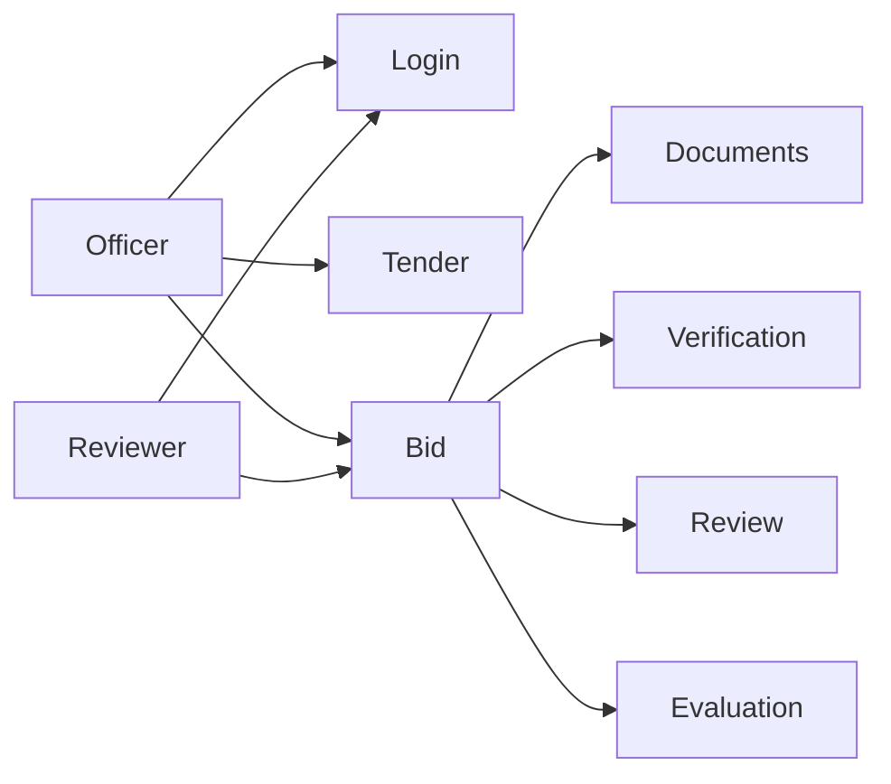
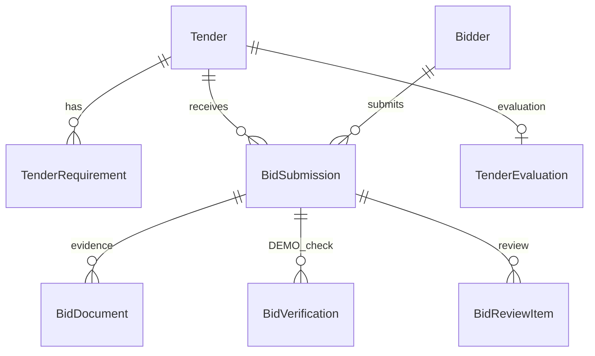

# BharatBid — Software Engineering Project Document

**Title:** BharatBid — Procurement Intelligence & Evidence-Based Bid Evaluation Platform  

**Context:** Smart India Hackathon Problem Statement **26100** (Ministry of Petroleum & Natural Gas / CPCL–GeM procurement setting)  

**Product type:** Decision-support software (not an award engine; not an official Government of India system)  

**License:** AGPL-3.0-or-later  

**Companion documents:** [README.md](../README.md), [PROBLEM_STATEMENT.md](../PROBLEM_STATEMENT.md), [ARCHITECTURE_DECISION.md](../ARCHITECTURE_DECISION.md), [BHARATBID_ARCHITECTURE.md](BHARATBID_ARCHITECTURE.md), [BHARATBID_SECURITY.md](BHARATBID_SECURITY.md), [BHARATBID_DEMO_GUIDE.md](BHARATBID_DEMO_GUIDE.md)

---

## Abstract

BharatBid is an integrated web application that helps procurement officers inspect tenders, bidder submissions, supporting documents, labeled DEMO government-source checks, cross-source comparisons, requirement coverage, officer review, comparative evaluation, and decision-support reports in one workspace. The system is designed around **traceability**: every important signal can be opened as evidence, and officers remain responsible for qualification-related decisions. Government-source adapters in this repository are **DEMO / SYNTHETIC**. The project is suitable as a complete undergraduate software-engineering assignment because it includes requirements, architecture, a relational schema, RBAC, testing, and honest limitations.

---

## 1. Introduction

Public-sector bid evaluation is document-heavy. Officers must relate GST, PAN, MSME, OEM, Make in India, and other evidence to tender requirements while noticing disagreements across sources. In practice this work is split across folders, portals, and email, which weakens consistency and later audit.

BharatBid implements a **Command Center** and bid-centric workspaces so that evidence, DEMO SOURCE results, human review, and comparison live on the same bid file. Artificial intelligence, where used, extracts or summarises; it does not award.

---

## 2. Problem statement

**SIH 26100** asks for an AI-powered integrated bid compliance verification platform for GeM / CPSE procurement.

Observed problems in the problem setting (not claimed as a field study):

- Fragmented bidder information
- Weak binding of documents to requirements
- Difficult-to-explain source checks
- Reviews and clarifications outside the bid file
- Comparison without a shared evidence matrix
- Risk of over-claiming “verified” or “winner”

See [PROBLEM_STATEMENT.md](../PROBLEM_STATEMENT.md).

---

## 3. Motivation

A procurement officer should be able to answer, for any bid:

1. What evidence was submitted?
2. What did a labeled source check return?
3. Where do sources disagree?
4. What still needs a human?
5. What did the officer finally record?

BharatBid is motivated by that inspectability, not by replacing the officer.

---

## 4. Aim

To design and implement a decision-support platform that organizes tender evaluation around **evidence, labeled DEMO verification, officer review, and comparative records**, with explicit DEMO labelling and no automatic award.

---

## 5. Objectives

1. Provide authenticated role-based access (officer, reviewer, admin).
2. Manage tenders, requirements, bidders, and bid submissions.
3. Support document upload, requirement mapping, extraction, and authenticated download.
4. Run inspectable DEMO SOURCE verification and cross-checks.
5. Compute explainable coverage and review-priority indicators on read.
6. Support officer review, clarification, comparative evaluation, and PDF reporting.
7. Aggregate operational status on a Command Center without a second ranking engine.
8. Document limitations honestly (no live government APIs in this submission).

---

## 6. Scope

**In scope:** Local / Compose demonstration; synthetic seed data; DEMO adapters; officer workflows listed in the README; JWT/RBAC; audit redaction; Vitest and GitHub Actions.

**Out of scope:** Production GSTN/MCA/Udyam/GeM connectivity; automatic ranking or award; government certification; claiming financial savings or departmental adoption.

---

## 7. Existing system

Typical evaluation (as described for this problem) relies on manual collection of certificates, ad-hoc spreadsheets, and late-stage review. Checks are hard to replay. This project does not assert a specific agency’s current software stack.

---

## 8. Proposed system

```text
Tender → requirements → bid + evidence
      → DEMO SOURCE verification → cross-checks
      → coverage / review risk / advisory
      → officer review → Officer Review Priority
      → comparative evaluation → decision-support record → PDF
```

Command Center (`/bharatbid`) shows the operational picture of those records.

---

## 9. Feasibility

| Dimension | Assessment |
| --- | --- |
| Technical | React, Express, PostgreSQL, and Prisma are implemented and tested in-repo |
| Operational | Docker Compose and `npm run dev` are documented |
| Legal | DEMO adapters avoid unauthorized live government API use |
| Economic | Demonstration uses open-source stack components already in `package.json` |

---

## 10. Functional requirements

| ID | Requirement | Priority |
| --- | --- | --- |
| FR-01 | JWT sign-in; role visible in the application shell | High |
| FR-02 | Tender lifecycle, status actions, ordered requirements | High |
| FR-03 | Bidder profiles; identifiers shown as provided / not provided | High |
| FR-04 | Bid create, submit, activity | High |
| FR-05 | Bid documents: type, version, mapping, extraction, download | High |
| FR-06 | DEMO verification with field comparison and source snapshot | High |
| FR-07 | Cross-verification GST ↔ MCA ↔ Udyam | High |
| FR-08 | Requirement intelligence / Evidence Coverage | High |
| FR-09 | Officer review: start, assess, clarify, close | High |
| FR-10 | Officer Review Priority with factor links | High |
| FR-11 | Tender comparison workspace; officer notes and decision-support states | High |
| FR-12 | Evaluation PDF with DEMO / SYNTHETIC disclaimer | High |
| FR-13 | Command Center dashboard from existing APIs | High |
| FR-14 | Search, notifications, procurement activity | Medium |
| FR-15 | Reviewer cannot perform officer write actions | High |

---

## 11. Non-functional requirements

| ID | Concern | How this repo treats it |
| --- | --- | --- |
| NFR-01 | Security | JWT, bcrypt, RBAC, Helmet, CORS, rate limits, SSRF helper — **not certified** |
| NFR-02 | Integrity | Prisma schema, migrations, server-side scores |
| NFR-03 | Auditability | Audit events; activity timeline; reports omit PAN/GSTIN/CIN/Udyam |
| NFR-04 | Usability | Light-first enterprise UI; DEMO ENVIRONMENT label |
| NFR-05 | Reliability | `/health`, `/ready`, Compose healthchecks |
| NFR-06 | Maintainability | TypeScript, ESLint, Vitest, documented `docs/` |
| NFR-07 | Scalability | Suitable for SIH seed data; async large-tender reports are future work |
| NFR-08 | Honesty | DEMO_MODE; adapters labeled DEMO SOURCE |

---

## 12. User requirements

- Officers need one file per bid with evidence and actions.
- Reviewers need read access without mutating officer-controlled workflows.
- Demonstrators need seed accounts and a scripted path ([BHARATBID_DEMO_GUIDE.md](BHARATBID_DEMO_GUIDE.md)).
- Evaluators need labelled DEMO sources so live APIs are not implied.

---

## 13. System requirements

- Browser-based SPA talking to REST `/api/v1`.
- PostgreSQL for durable state; Redis for jobs/rate limits in the documented Compose setup.
- Optional Gemini key for document intelligence; mock provider in tests.

---

## 14. Hardware requirements (development / demo)

| Item | Typical |
| --- | --- |
| CPU | Dual-core or better development laptop |
| RAM | 8 GB recommended when Docker Desktop is used |
| Disk | Space for Node modules, Docker images, and `storage/` |
| Display | Desktop or laptop; the UI is desktop-primary |

These are development guidance, not a production SLA.

---

## 15. Software requirements

| Software | Version / notes |
| --- | --- |
| Node.js | 20+ (`.nvmrc`) |
| npm | 10+ |
| Docker Desktop | Postgres 16 on host **5433**, Redis 7 |
| Git | Clone and version control |

---

## 16. System architecture

```text
React / Vite
    → Express /api/v1
        → authenticate + requirePermission
        → BharatBid services (`backend/src/problem/`)
        → Prisma / PostgreSQL
        → storage, extraction, notifications, PDF, audit, jobs
```

Layers and security boundaries: [BHARATBID_ARCHITECTURE.md](BHARATBID_ARCHITECTURE.md).

---

## 17. Module description

| Module | Responsibility |
| --- | --- |
| Authentication | Login, refresh rotation, password hashing |
| RBAC | Roles and `resource.action` permissions |
| Tenders | Files, requirements, status |
| Bidders | Identity presence, participation |
| Bids | Submissions and tabs (documents → evaluation) |
| Documents | Upload, map, extract, download |
| Verification | DEMO adapters and evidence modal |
| Intelligence | Coverage, risk, advisory, attention |
| Review | Machine finding vs officer assessment |
| Evaluation | Comparison, notes, decision-support states, PDF |
| Command Center | Aggregation of KPIs and queues |
| Notifications / activity | Inbox and timeline |

---

## 18. Use cases

| ID | Actor | Use case |
| --- | --- | --- |
| UC-01 | Officer | Sign in and open Command Center |
| UC-02 | Officer | Create / open a tender and requirements |
| UC-03 | Officer | Register a bidder and create a bid |
| UC-04 | Officer | Upload and map documents |
| UC-05 | Officer | Run DEMO verification and inspect evidence |
| UC-06 | Officer | Open cross-checks and reviews |
| UC-07 | Officer | Inspect Officer Review Priority factors |
| UC-08 | Officer | Compare bids and record a decision-support state |
| UC-09 | Officer | Download evaluation PDF |
| UC-10 | Reviewer | Read the same files; writes return 403 |



---

## 19. Data flow

```text
Officer UI
  → HTTPS/HTTP JSON /api/v1
  → Zod validation
  → Domain service
  → Prisma
  → PostgreSQL

Documents
  → Multer + storage provider
  → extraction job / AI adapter (untrusted output)
  → BidDocument + extraction records

Verification
  → DEMO adapter registry
  → BidVerification + field comparisons
```

---

## 20. Database design

Major entities (Prisma): `User`, `Role`, `Permission`, `Tender`, `TenderRequirement`, `Bidder`, `BidSubmission`, `BidDocument`, `BidVerification`, `BidCrossVerification`, `BidReviewItem`, `ReviewAssessment`, `ReviewClarification`, `TenderEvaluation`, `EvaluationNote`, `EvaluationDecision`, plus notifications, audit, and storage tables.



Canonical schema: `database/prisma/schema.prisma`.

---

## 21. Technology stack

Frontend: React, Vite, TypeScript, Tailwind, Vitest.  
Backend: Express, Prisma, Zod, JWT, bcrypt, Pino, pdf-lib, BullMQ.  
Data: PostgreSQL, Redis.  
Ops: Docker Compose, GitHub Actions.

---

## 22. Security

Passwords hashed (bcrypt). JWT access + rotating refresh. RBAC enforced on `/api/v1`. Documents downloaded through authenticated APIs. Audit omits sensitive identifiers. DEMO adapters do not call live government endpoints.

This document is **not** a pentest report. See [BHARATBID_SECURITY.md](BHARATBID_SECURITY.md).

---

## 23. Testing strategy

| Layer | Location | Tool |
| --- | --- | --- |
| Unit | `backend/src/**/*.test.ts`, `frontend/src/**/*.test.tsx` | Vitest |
| Integration | `backend/tests/**` | Vitest, Supertest, Prisma |
| API e2e | `backend/tests/e2e` | Vitest + `createApp` |
| CI | `.github/workflows/ci.yml` | Lint, typecheck, tests, Docker smoke |

External AI/email/SMS/S3 are mocked. Coverage percentages are obtained by running `npm run test:coverage`; they are not frozen in this document.

---

## 24. Results / current implementation

A demonstrable officer path exists from login through Command Center, tender, bid tabs, DEMO verification, review priority, comparison, and PDF. Seed tender `GEM/2026/B/CPCL/001` with Bayfront (stronger evidence) and Delta (attention-heavy) scenarios supports live demonstration. The SIH readiness checklist in-repo records product and engineering items as implemented for demo prep; presenters should still walk the UI on the demo machine.

---

## 25. Limitations

- Government sources are simulated.
- Demo password is for local SIH only.
- JWT secrets in `.env.example` are local-dev placeholders.
- Email/SMS are disabled by default.
- Large-scale async reporting is not the SIH path (reports are synchronous for seed data).
- No screenshots are currently committed in the repository.

---

## 26. Future scope

Authorized live adapters (legal access required), async reports for large tenders, saved dashboard filters, production secret management. **Do not** implement winner ranking or automatic award. See [BHARATBID_FUTURE_SCOPE.md](BHARATBID_FUTURE_SCOPE.md).

---

## 27. Conclusion

BharatBid shows that bid compliance verification can be implemented as an **evidence-first, officer-controlled workspace** with honest DEMO labelling, a complete application stack, and academic artefacts (requirements, architecture, schema, tests). The correct success criterion for SIH and for a college evaluation is the same: a judge can follow the demo guide without being told that live government APIs or automatic awards exist.

---

## 28. References

1. BharatBid repository documentation: README, PROBLEM_STATEMENT.md, ARCHITECTURE_DECISION.md, docs/ index.
2. Smart India Hackathon Problem Statement 26100 as framed in this repository’s PROBLEM_STATEMENT.md (GeM / CPSE / MoPNG–CPCL *context*).
3. React, Vite, Express, Prisma, PostgreSQL, Docker, Vitest — versions as declared in workspace `package.json` files.
4. GNU Affero General Public License v3.0 or later (`LICENSE`).
5. GeM (Government e-Marketplace) as the public procurement *setting* for the problem — not as a live integration in this codebase.

No additional academic papers are cited here because they are not dependencies of the implementation.
