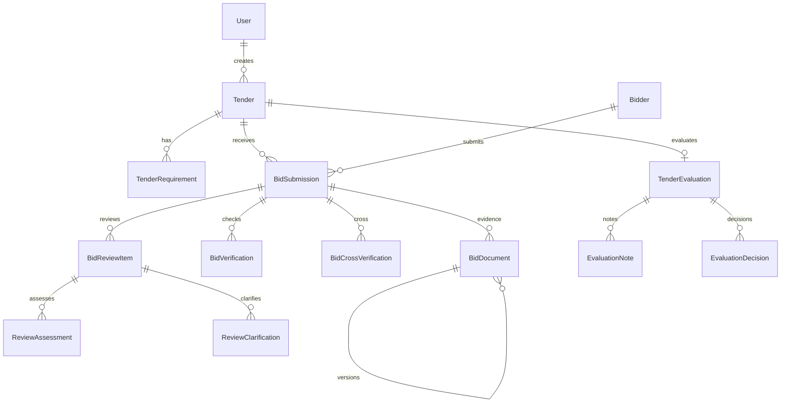
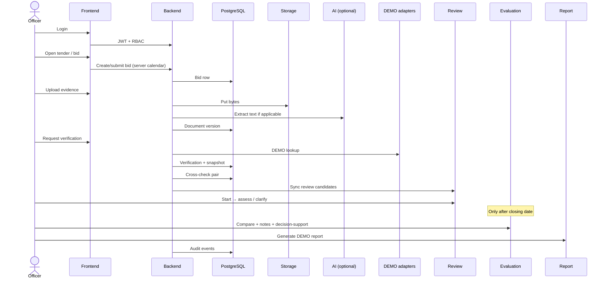

# BharatBid — Complete workflow

This document describes the **existing** BharatBid implementation (SIH 2026, PS 26100) after targeted hardening. It is the operational map of the product, not a redesign proposal.

**Honesty labels used throughout the product**

- **DEMO / SYNTHETIC** — seeded or generated data for demonstration.
- **DEMO — SYNTHETIC DATA** — verification adapters that look up fixture records. They are **not** live GSTN, MCA, Udyam, GeM, or other government APIs.
- **SANDBOX / LIVE** — only after an authorized provider is configured and a real HTTPS call succeeds.
- **Organization workspace** — officers see only tenders/bidders in organizations they belong to.

BharatBid is a **decision-support** platform. Officers remain responsible for procurement outcomes.

---

## A. System overview

BharatBid is an integrated bid compliance workspace for GeM-style procurement. It helps a procurement officer:

1. Record a tender and its mandatory/optional requirements.
2. Record bidders and one bid per bidder per tender.
3. Collect documentary evidence, version it, and extract text where possible.
4. Run **DEMO SOURCE** identifier checks (GST, MCA, Udyam, GeM, PAN, and related registries).
5. Cross-check comparable DEMO records (GST ↔ MCA, GST ↔ Udyam, MCA ↔ Udyam).
6. See requirement-level evidence coverage (present / missing / incomplete / mismatch / unavailable).
7. Open officer review items, request in-app clarification, and record assessments.
8. After the closing date, compare eligible bids and record **decision-support** notes — not automatic awards.
9. Generate a PDF report and inspect the audit trail.

The system does **not** automatically select a winner, award a tender, reject a bidder, or certify government verification.

---

## B. Architecture

| Layer | Implementation | Role |
| --- | --- | --- |
| Frontend | React 18, Vite, Tailwind | Officer/reviewer UI, route guards, RBAC-aware actions |
| Backend | Express, `/api/v1` | Authentication, permissions, domain services |
| Database | PostgreSQL via Prisma | Tenders, bids, documents, verifications, reviews, evaluations, audit |
| Storage | Local disk (demo) / S3-capable interface | Document bytes keyed by server-generated storage keys |
| Queue | Redis + BullMQ (optional workers) | Background jobs; verification can also run in-request in demo |
| AI | Guardrailed generate/extract/classify | Extraction and drafting assistance; **not** award logic |
| Verification | Adapter registry (`demo` mode) | Fixture lookups with provenance |
| Audit | `audit_events` | Server-timestamped mutations with redaction |

Domain code lives in `backend/src/problem/`. Frontend routes live under `/bharatbid/*`.

There is **no multi-tenant organisation isolation**. All authenticated officers with the right permission can see the same tenders. See section U.

---

## C. User workflow

```text
LOGIN
  → COMMAND CENTER (/bharatbid)
  → TENDERS (/bharatbid/tenders)
  → TENDER DETAILS
  → BIDDERS / BIDS
  → DOCUMENTS
  → VERIFICATION
  → CROSS-CHECK
  → REQUIREMENT COVERAGE
  → OFFICER REVIEW
  → CLARIFICATION (in-app only)
  → EVALUATION (after closing date)
  → DECISION SUPPORT (officer notes/decisions)
  → REPORT (PDF)
  → AUDIT
```

**Demo login:** `demo.officer@example.com` / `demo-password`.

Backend authorization is independent of the UI. Hidden buttons are not a security boundary.

---

## D. Tender lifecycle

Allowed transitions (enforced on the API):

```text
draft → open | cancelled
open → under_evaluation | cancelled
under_evaluation → closed | cancelled
closed → awarded
awarded → (terminal)
cancelled → (terminal)
```

**Calendar rules (server time only; client clocks are ignored)**

| Moment | Rule |
| --- | --- |
| Before issue date | Cannot open. Cannot accept bids. |
| Exactly at issue date | May open. |
| During open window (`status = open` and now ≤ closing date) | Bids may be created and submitted. Evaluation must not begin. |
| Exactly at closing date | Last instant bids are still accepted (`now <= closingDate`). |
| After closing date | New bids rejected. Evaluation may begin. UI hides “Start evaluation” until this point. |
| Closed / awarded / cancelled | No new bids. Document mutations blocked for closed/awarded/cancelled. |

Tenders may be **created** as `draft` or `open` (open only if the issue date has been reached). They cannot be created already in evaluation, closed, awarded, or cancelled.

Repeated identical status posts are no-ops. Illegal jumps (`draft → under_evaluation`, `closed → open`, `closed → cancelled`) are rejected.

---

## E. Bid lifecycle

```text
draft → submitted | withdrawn
submitted → under_review | withdrawn
under_review → finalized | withdrawn
withdrawn / finalized → (terminal in this slice)
```

Rules:

- One bid per `(tenderId, bidderId)` — unique constraint plus application-level conflict handling.
- Create and submit only while the tender is **open** and the server clock is inside the issue–closing window.
- Submitted bids cannot be edited via the draft update path.
- Duplicate concurrent creates: one succeeds, the other receives **409**.

The seed tender `GEM/2026/B/CPCL/001` has closing `2026-09-15T18:30:00.000Z`. After that instant, **new** bids on that tender are correctly rejected; seeded bids remain.

---

## F. Document lifecycle

```text
Upload → validate → store → extract → version (current + archived) → evidence mapping
```

**Validation (never trust the browser)**

- Size limit.
- Allowed extensions: pdf, png, jpg, jpeg, txt.
- Declared MIME must match extension.
- Magic bytes / content signature must match type.
- Safe filename (no `../`, no Windows `..\\`).
- SHA-256 checksum; duplicate current checksum on the same bid is rejected.
- Persisted MIME is the **canonical** type for the extension, not the raw client header.

**Storage key** is server-generated (`bids/{bidId}/documents/{id}/vN`). Path traversal into storage is blocked.

**Versioning:** replacement creates a new row (`groupId` + `versionNumber`), marks previous `isCurrent = false`. Historical bytes remain.

**Immutability:** after the tender is `closed`, `awarded`, or `cancelled`, upload/replace/link/archive are rejected so evaluation evidence is not silently rewritten. During `open` and `under_evaluation`, new versions remain possible (including DEMO clarification attachments).

**Extraction:** UTF-8 text files and uncompressed PDF string extraction. Scanned PDFs and images are **not OCR’d**. The original file is still stored. Extraction is an assistance step, not a legal finding.

---

## G. AI workflow

AI is used for:

- Text generation, summarization, classification, field extraction, analysis, recommendations, drafting (authenticated `AI_USE` permission).
- Optional assistance on document text.

AI is **not** used to:

- Choose a winner.
- Award or reject a bid.
- Bypass tender/bid calendar or RBAC.

HTTP `POST /api/v1/ai/structured` accepts only schema `insight`. The `decision` envelope is **not** exposed on that public structured route (it remains an internal helper with `requiresReview`).

Model JSON is schema-validated. Malformed or low-confidence output is treated as untrusted assistance.

---

## H. Verification workflow

Adapters: GST, MCA, Udyam, GeM, PAN, Income Tax, EPFO, ESIC, DPIIT, NSIC, debarment, BIS.

| Property | Current value |
| --- | --- |
| Mode | `demo` |
| Availability | Fixture lookup |
| LIVE government API | **Not implemented** |

Each stored result includes source, display name, mode, identifier type, status, explanation, snapshot, `verifiedAt`, `retrievedAt`, `cacheAge`, `expiresAt`, and `servedFromCache`. Cached live lookups display **CACHED**, never **LIVE**. **VERIFY NOW** (`force: true`) requests a fresh lookup.

Statuses include `matched`, `mismatched`, `not_found`, `error`, plus processing states. Adapter failure becomes `error` or `not_found` — **not** a false “verified” match.

Field-level outcomes can be `match`, `potential_match`, `mismatch`, `review_required`, `not_compared`. Debarment `RECORD_FOUND` attributes are `review_required` (officer inspects; not automatic rejection).

---

## I. Cross-verification

Comparable pairs only: GST↔MCA, GST↔Udyam, MCA↔Udyam. GST↔GeM is `not_comparable`.

Overall statuses:

| Status | Meaning |
| --- | --- |
| `consistent` | Compared fields agree after normalization |
| `inconsistent` | A real difference on a present field (not fraud) |
| `insufficient_evidence` | Missing record, missing field on one side, or source error/not_found |
| `not_comparable` | Pair is outside this slice |
| `error` | Reserved; source errors currently map to insufficient evidence at pair level |

Missing data is **not** a mismatch. Explanations state DEMO / SIMULATED (or MIXED if an external mode were present).

---

## J. Requirement intelligence

Chain: Tender → Requirement → Bid → Evidence → Verification → Cross-check → Review.

The coverage engine distinguishes evidence available, missing, incomplete, mismatch, verification unavailable, and clarification required. Missing documents are **not** labelled fraud.

**Requirement freeze:** requirements are mutable only in `draft`. After publish/`open`, silent add/edit/reorder/activate is rejected. Officers record a **versioned amendment** (`POST .../requirements/:id/amendments`) with `version`, `createdBy`, `createdAt`/`effectiveAt`, `changeReason`, and `previousVersion`. Historical rows stay inactive. Amendments are allowed only while the tender is `open`.

---

## K. Officer review

Item statuses:

```text
open → in_review          (Start review)
in_review → assessed | clarification_requested
clarification_requested → in_review (after DEMO response)
assessed → closed | clarification_requested
```

`open → assessed` is **rejected**. Officers must start review (or use clarification) before recording an assessment.

`closed → in_review` is rejected.

Assessments are append-only with attempt numbers. Machine findings are not overwritten.

---

## L. Clarification workflow

1. Officer stores an in-app request (`clarification_requested`).
2. A **DEMO** response can be recorded in the UI (no bidder email, no government message).
3. Item returns to `in_review` for reassessment.

Traceable on the review item and in audit metadata.

---

## M. Attention / review-priority logic

**Officer Review Priority** (`attention-v1`) is a deterministic 0–100 score with category caps.

It means: *this case has factors that may deserve closer officer review.*

It does **not** mean: bidder quality, fraud score, winner score, rejection score, or award recommendation.

Example weights: missing mandatory evidence (20), verification mismatch (20), cross-source inconsistency (22), verification not found (10), verification error (8), missing field / insufficient cross evidence (8), unresolved officer review (12).

Bands: low / moderate / elevated / high / critical attention.

---

## N. Comparative evaluation

After the closing date, officers may create a tender evaluation, start it, add notes, mark ready, and record **decision-support** entries.

Only submitted (evaluable) bids are compared. Draft/withdrawn bids are excluded.

Cells describe available / missing / verified / inconsistent / clarification / unavailable based on stored evidence.

**Financial evaluation is outside the implemented scope.** The UI and reports state that financial ranking is unavailable. No fabricated prices or scores.

---

## O. Decision support

Officers record notes and decision-support types. The product copy states that this does not award, reject, or certify.

There is no automatic winner selection.

---

## P. Report generation

`GET /api/v1/tenders/:id/reports/evaluation` (permission `reports.generate`) produces a PDF decision-support record: tender identity, bid evidence summaries, DEMO verification labels, review/evaluation notes, and a disclaimer that the PDF is not an award or government certificate.

---

## Q. Audit trail

Mutations (tender, bid, document, verification, cross-check, review, evaluation, report access where recorded) write `audit_events` with **server** `createdAt`.

Redaction strips passwords, tokens, JWTs, API keys, PAN/GSTIN/CIN/Udyam, emails, Aadhaar-like keys, storage keys, and extracted text dumps from metadata.

---

## R. Security

- JWT access + rotating refresh; RBAC permissions on every sensitive route.
- Nested resources require parent match (bid document, verification, cross-check, review) to reduce IDOR/BOLA.
- Uploads validated as in section F.
- Errors: clients get structured codes; stack traces and SQL are not returned to users in production 500s.
- **No organisation tenancy** — see U.

---

## S. Database relationships



Important constraints: unique tender `referenceNumber`; unique bid `(tenderId, bidderId)`; unique bidder identifiers when present; evaluation unique per tender.

---

## T. End-to-end sequence



---

## U. Current limitations

| Area | Limitation |
| --- | --- |
| Government verification | DEMO SOURCE fixtures only. Not live GSTN/MCA/Udyam/GeM. |
| OCR | No production OCR. Images and scanned PDFs are stored, not read as text. |
| Financial evaluation | Not implemented. |
| Multi-tenant isolation | Not implemented. Any officer with `tenders.read` can list all tenders. Nested IDs are scoped to parent bid/tender, not to an organisation. |
| Requirement versioning | Versioned amendments while `open`; historical versions preserved. Silent edits after publish are blocked. |
| Attention score | Review-priority only; never a winner/fraud score. |
| Clarification | In-app DEMO response; no bidder email. |
| Tenancy TODO | Production should add `organisationId` (or equivalent) on User, Tender, Bidder and enforce it on every query. |

Never present DEMO adapters as live government integrations.
